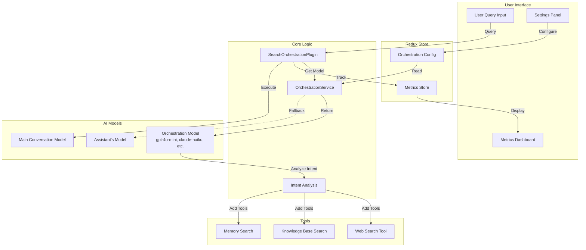
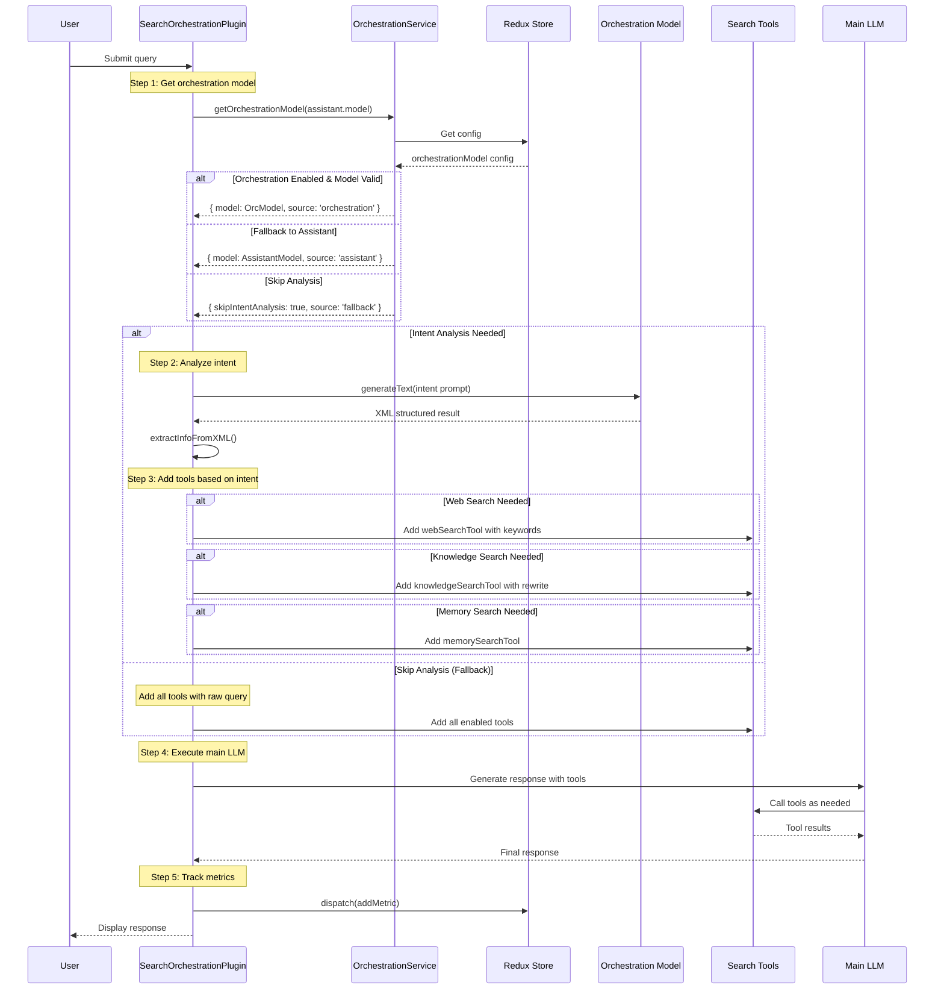
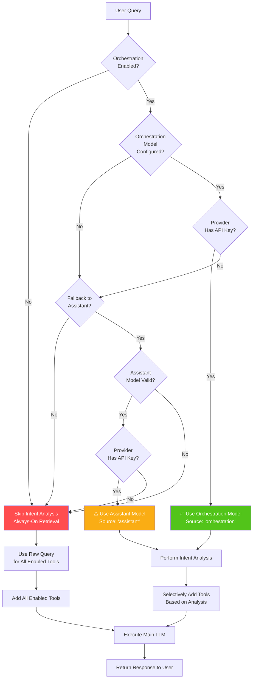
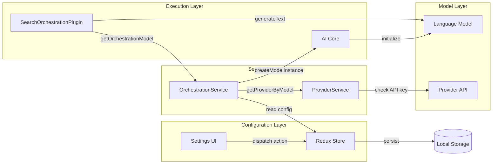
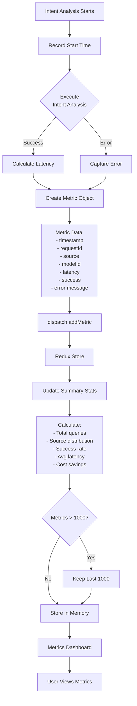
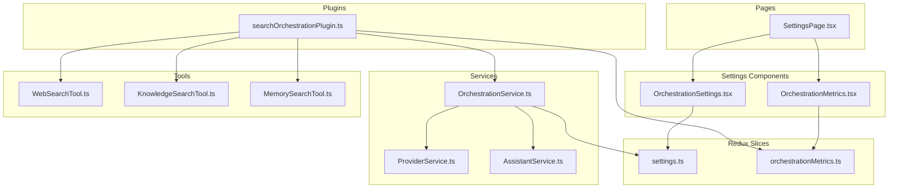
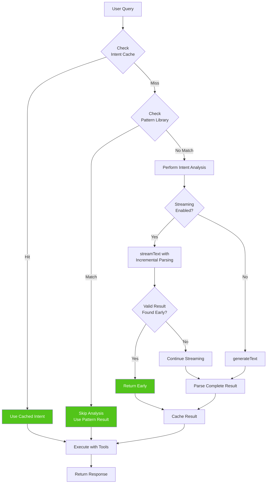
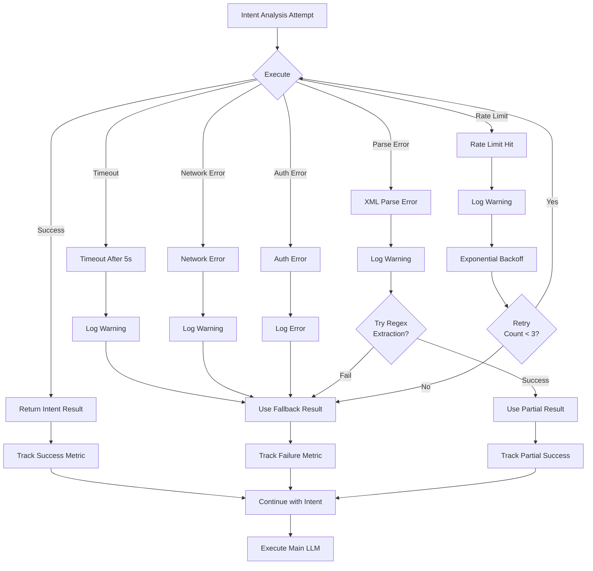
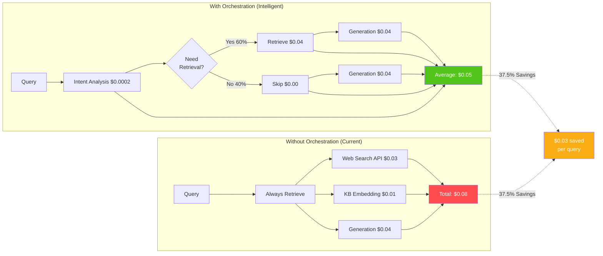
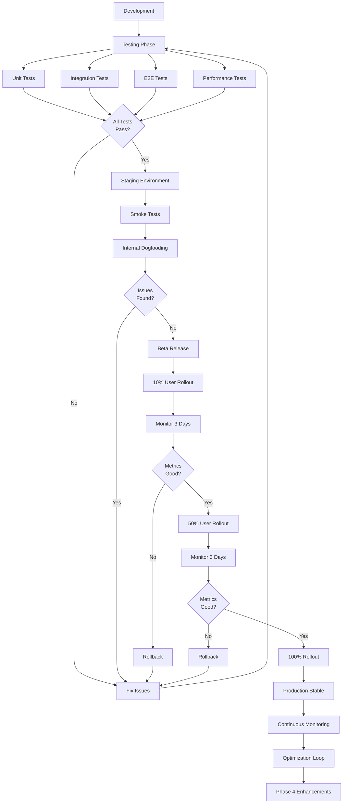

# Intelligent Search Orchestration - Architecture Diagrams

## System Overview



## Detailed Flow: Query Processing



## Fallback Hierarchy



## Data Flow: Settings to Execution



## Metrics Tracking Flow



## Component Architecture



## Performance Optimization Flow (Phase 4)



## Error Handling & Recovery



## Cost Comparison: With vs Without Orchestration



## Deployment & Rollout Strategy



---

## Key Takeaways

### Architecture Principles

1. **Separation of Concerns**: Orchestration model separate from main conversation model
2. **Graceful Degradation**: Multiple fallback levels ensure system always works
3. **Observable**: Comprehensive metrics tracking for monitoring and optimization
4. **Configurable**: User has full control over orchestration behavior
5. **Performant**: Caching, patterns, and streaming for optimal speed

### Decision Flow Summary

```
User Query
    ↓
Is orchestration enabled?
    ├─ No → Skip intent analysis (always-on retrieval)
    └─ Yes → Get orchestration model
        ├─ Orchestration model valid? → Use it ✅
        ├─ Fallback enabled & assistant model valid? → Use it ⚠️
        └─ Neither available → Skip analysis ❌
            ↓
Perform intent analysis (or skip)
    ↓
Add appropriate tools based on intent
    ↓
Execute main LLM with tools
    ↓
Track metrics
    ↓
Return response
```

### Cost Savings Breakdown

For 1000 queries/day:

**Without Orchestration:**
- Every query: Web search ($0.03) + KB embedding ($0.01) + Generation ($0.04) = $0.08
- Daily cost: 1000 × $0.08 = $80
- Monthly cost: $2,400

**With Orchestration:**
- Intent analysis: $0.0002 per query
- 60% need retrieval: 600 × ($0.0002 + $0.04 + $0.04) = $48.12
- 40% skip retrieval: 400 × ($0.0002 + $0.04) = $16.08
- Daily cost: $64.20
- Monthly cost: $1,926

**Savings: $474/month (19.75%)**

*Note: Research suggests 30-50% savings are achievable with optimization.*

---

## References

- Full Specification: `INTENT_ORCHESTRATION_IMPLEMENTATION_SPEC.md`
- Quick Start Guide: `ORCHESTRATION_QUICK_START.md`
- Mermaid Documentation: https://mermaid.js.org/


