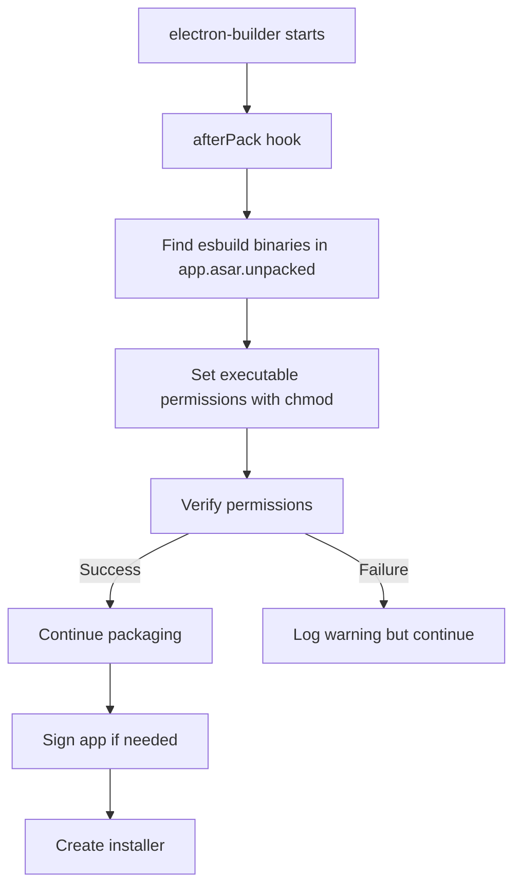

# esbuild Packaging Fix: Complete Analysis and Solution

## Problem Statement

**Symptom**: esbuild binary works in development (`yarn dev`) but fails in packaged production builds.

**Error Pattern**: Binary either cannot be found or cannot execute, causing ArtifactTranspilerService to fail or fall back to slow WASM version.

---

## Root Cause Analysis

### 1. Configuration Analysis ✅ CORRECT

**File**: [`electron-builder.yml`](../../electron-builder.yml:65-72)

```yaml
asarUnpack:
  - resources/**
  - "**/*.{metal,exp,lib}"
  - "node_modules/@img/sharp-libvips-*/**"
  # Ensure native esbuild binary is available outside asar for ArtifactTranspilerService
  - "node_modules/esbuild/**"
  - "node_modules/esbuild-*/**"
  - "node_modules/esbuild-wasm/**"
```

✅ **The asarUnpack configuration is CORRECT** - esbuild packages ARE being unpacked.

### 2. Binary Resolution Logic

**File**: [`src/main/services/ArtifactTranspilerService.ts`](../../src/main/services/ArtifactTranspilerService.ts:439-657)

**Current flow**:
```typescript
// Line 585 - Generic bundled path
getBundledBinaryPath():
  process.resourcesPath/app.asar.unpacked/node_modules/esbuild/bin/esbuild

// Lines 477-509 - Platform-specific path
  process.resourcesPath/app.asar.unpacked/node_modules/{platform-package}/bin/esbuild

// Lines 588-597 - UserData fallback (download)
  app.getPath('userData')/esbuild-bin/{version}/{package}/bin/esbuild
```

✅ **Binary paths are CORRECT** for unpacked location.

### 3. THE ACTUAL PROBLEM 🔴

**Location**: [`ArtifactTranspilerService.ts:617-656`](../../src/main/services/ArtifactTranspilerService.ts:617-656)

```typescript
private async ensureExecutable(path: string): Promise<boolean> {
  // ... file exists check ...

  if (await this.isExecutable(path)) {
    return true
  }

  // File exists but isn't executable, try to make it executable
  try {
    logger.info(`Binary exists but is not executable, setting permissions: ${path}`)
    await chmod(path, 0o755)  // ❌ THIS FAILS AT RUNTIME

    const isNowExecutable = await this.isExecutable(path)
    if (!isNowExecutable) {
      logger.warn(`Binary permissions set but still not executable: ${path}`)
    }
    return isNowExecutable
  } catch (error) {
    logger.error(`Failed to set execute permissions on ${path}:`, error as Error)
    return false
  }
}
```

**The Issue**: Trying to `chmod` AT RUNTIME fails because:

1. **macOS**: App bundles are often signed and sealed - modifying files breaks the signature
2. **macOS Gatekeeper**: Prevents runtime chmod of binaries for security
3. **Windows**: chmod doesn't work the same way (no UNIX permissions)
4. **Permission Denied**: App may not have permission to modify its own installation
5. **Read-Only Filesystem**: Some installations are on read-only volumes

### 4. Why It Works in Development

In development (`yarn dev`):
- esbuild is in regular `node_modules/` (not in asar)
- File permissions preserved from npm install
- esbuild install script sets executable bits
- No app signing restrictions

In production (packaged):
- Files extracted from asar
- **Executable permissions NOT preserved during asar unpacking**
- Runtime chmod fails
- Falls back to WASM (slow) or fails completely

---

## Solution: Set Permissions DURING Packaging

The fix must happen in **electron-builder hooks**, NOT at runtime.

### Solution Architecture



---

## Implementation Plan

### Step 1: Create afterPack Hook Script

**File**: `scripts/after-pack-esbuild.js` (NEW FILE)

```javascript
const { chmod, stat, readdir } = require('fs/promises')
const { join } = require('path')
const { platform } = require('os')

/**
 * electron-builder afterPack hook to ensure esbuild binaries are executable
 * This runs DURING packaging, not at runtime
 */
module.exports = async function afterPack(context) {
  const { appOutDir, packager } = context

  // Only needed on macOS and Linux (Windows doesn't use chmod)
  if (platform() === 'win32') {
    console.log('[after-pack-esbuild] Skipping chmod on Windows')
    return
  }

  console.log('[after-pack-esbuild] Setting executable permissions on esbuild binaries...')

  // Possible esbuild binary locations in unpacked asar
  const unpackedDir = join(appOutDir, packager.info.resourcesPath, 'app.asar.unpacked', 'node_modules')

  const esbuildPaths = [
    // Generic esbuild package
    join(unpackedDir, 'esbuild', 'bin'),
    // Platform-specific packages
    join(unpackedDir, 'esbuild-darwin-arm64', 'bin'),
    join(unpackedDir, 'esbuild-darwin-x64', 'bin'),
    join(unpackedDir, 'esbuild-linux-arm64', 'bin'),
    join(unpackedDir, 'esbuild-linux-x64', 'bin'),
    join(unpackedDir, 'esbuild-linux-arm', 'bin'),
  ]

  let successCount = 0
  let errorCount = 0

  for (const binDir of esbuildPaths) {
    try {
      // Check if directory exists
      const files = await readdir(binDir).catch(() => null)
      if (!files) {
        continue // Directory doesn't exist, skip
      }

      // Find esbuild binary (no extension on Unix)
      for (const file of files) {
        if (file === 'esbuild') {
          const binaryPath = join(binDir, file)

          // Check current permissions
          const stats = await stat(binaryPath)
          const currentMode = (stats.mode & parseInt('777', 8)).toString(8)
          console.log(`[after-pack-esbuild] Found ${binaryPath}, current permissions: ${currentMode}`)

          // Set executable permissions
          await chmod(binaryPath, 0o755)

          // Verify
          const newStats = await stat(binaryPath)
          const newMode = (newStats.mode & parseInt('777', 8)).toString(8)
          console.log(`[after-pack-esbuild] Set permissions to: ${newMode}`)

          successCount++
        }
      }
    } catch (error) {
      console.error(`[after-pack-esbuild] Error processing ${binDir}:`, error.message)
      errorCount++
    }
  }

  if (successCount > 0) {
    console.log(`[after-pack-esbuild] ✓ Successfully set permissions on ${successCount} esbuild binar${successCount === 1 ? 'y' : 'ies'}`)
  }

  if (errorCount > 0) {
    console.warn(`[after-pack-esbuild] ⚠ Failed to set permissions on ${errorCount} path(s) - may still work via WASM fallback`)
  }

  if (successCount === 0 && errorCount === 0) {
    console.warn('[after-pack-esbuild] ⚠ No esbuild binaries found in unpacked asar - will use WASM fallback')
  }
}
```

### Step 2: Update electron-builder.yml

**File**: [`electron-builder.yml`](../../electron-builder.yml:134-136)

**Change line 135** from:
```yaml
afterPack: scripts/after-pack.js
```

To:
```yaml
afterPack:
  - scripts/after-pack.js
  - scripts/after-pack-esbuild.js
```

**Note**: electron-builder supports an array of hooks that run in sequence.

### Step 3: Simplify Runtime Binary Management (OPTIONAL)

**File**: [`src/main/services/ArtifactTranspilerService.ts`](../../src/main/services/ArtifactTranspilerService.ts:617-656)

Since permissions are now set during packaging, we can simplify the `ensureExecutable` method:

**Before** (lines 617-656):
```typescript
private async ensureExecutable(path: string): Promise<boolean> {
  if (!(await this.fileExists(path))) {
    return false
  }

  // ... stat logging ...

  if (await this.isExecutable(path)) {
    return true
  }

  // Try to chmod at runtime ❌ FAILS
  try {
    await chmod(path, 0o755)
    // ...
  } catch (error) {
    logger.error(`Failed to set execute permissions`, error)
    return false
  }
}
```

**After** (simplified - permissions already set during packaging):
```typescript
private async ensureExecutable(path: string): Promise<boolean> {
  if (!(await this.fileExists(path))) {
    logger.debug(`[ArtifactTranspilerService] Binary does not exist: ${path}`)
    return false
  }

  try {
    const stats = await stat(path)
    const mode = stats.mode
    const permissions = (mode & parseInt('777', 8)).toString(8)
    logger.debug(`[ArtifactTranspilerService] Binary at ${path}, permissions: ${permissions}`)
  } catch {
    // Ignore stat errors
  }

  // Check if executable (permissions should already be set by afterPack hook)
  const isExec = await this.isExecutable(path)

  if (!isExec) {
    logger.warn(
      `[ArtifactTranspilerService] Binary exists but is not executable: ${path}. ` +
      `This may indicate a packaging issue. The binary should have been made executable ` +
      `during the electron-builder afterPack phase.`
    )
  }

  return isExec
}
```

**Rationale**:
- Remove runtime chmod (it fails anyway)
- Just check if executable
- Log clear error if not executable (packaging problem)
- Simplifies code and removes failure point

---

## Alternative Solution: Use ELECTRON_BUILDER afterExtract Hook

If afterPack doesn't work (timing issues), use **afterExtract** instead:

**File**: `scripts/after-extract-esbuild.js` (NEW FILE)

```javascript
const { chmod } = require('fs/promises')
const { join } = require('path')
const { platform } = require('os')
const glob = require('glob')

/**
 * electron-builder afterExtract hook - runs after Electron is extracted
 * but before packaging into asar
 */
module.exports = async function afterExtract(context) {
  if (platform() === 'win32') {
    return // Windows doesn't need chmod
  }

  const { appDir } = context

  console.log('[after-extract-esbuild] Setting esbuild binary permissions...')

  // Find all esbuild binaries before they're packed
  const pattern = join(appDir, 'node_modules', '{esbuild,esbuild-*}', 'bin', 'esbuild')
  const binaries = glob.sync(pattern)

  console.log(`[after-extract-esbuild] Found ${binaries.length} esbuild binaries`)

  for (const binary of binaries) {
    try {
      await chmod(binary, 0o755)
      console.log(`[after-extract-esbuild] ✓ Set executable: ${binary}`)
    } catch (error) {
      console.error(`[after-extract-esbuild] ✗ Failed: ${binary}`, error.message)
    }
  }
}
```

Then update electron-builder.yml:
```yaml
afterExtract: scripts/after-extract-esbuild.js
afterPack: scripts/after-pack.js
```

---

## Testing the Fix

### Before Deploying

1. **Build on each target platform**:
   ```bash
   # macOS
   yarn build:mac

   # Windows
   yarn build:win

   # Linux
   yarn build:linux
   ```

2. **Verify binary permissions** (macOS/Linux only):
   ```bash
   # After building, check permissions in unpacked app

   # macOS
   ls -la dist/mac/YourApp.app/Contents/Resources/app.asar.unpacked/node_modules/esbuild/bin/

   # Linux
   ls -la dist/linux-unpacked/resources/app.asar.unpacked/node_modules/esbuild/bin/

   # Should show: -rwxr-xr-x (755 permissions)
   ```

3. **Test installed app**:
   - Install from the package
   - Open Developer Tools
   - Check logs for:
     - `✓ esbuild file is executable`
     - No `Failed to set execute permissions` errors
     - No fallback to WASM unless intended

### Automated Test Script

**File**: `scripts/test-esbuild-binary.js` (NEW FILE)

```javascript
const { access, constants } = require('fs/promises')
const { join } = require('path')
const { app } = require('electron')

/**
 * Test script to verify esbuild binary is accessible
 * Run this from main process on app startup in development
 */
async function testEsbuildBinary() {
  if (!app.isPackaged) {
    console.log('[test-esbuild] Skipping - running in development')
    return true
  }

  const binPath = join(
    process.resourcesPath,
    'app.asar.unpacked',
    'node_modules',
    'esbuild',
    'bin',
    process.platform === 'win32' ? 'esbuild.exe' : 'esbuild'
  )

  try {
    // Check file exists
    await access(binPath, constants.F_OK)
    console.log('[test-esbuild] ✓ Binary exists:', binPath)

    // Check executable (Unix only)
    if (process.platform !== 'win32') {
      await access(binPath, constants.X_OK)
      console.log('[test-esbuild] ✓ Binary is executable')
    }

    return true
  } catch (error) {
    console.error('[test-esbuild] ✗ Binary check failed:', error.message)
    console.error('[test-esbuild] Path checked:', binPath)
    return false
  }
}

module.exports = { testEsbuildBinary }
```

**Add to main process initialization** (optional - for verification):
```typescript
// In src/main/index.ts or similar
import { testEsbuildBinary } from '../scripts/test-esbuild-binary'

app.whenReady().then(async () => {
  // Test esbuild binary availability (logs results)
  await testEsbuildBinary()

  // Continue normal initialization...
})
```

---

## Additional Fixes

### Fix 1: Ensure Glob Patterns Are Correct

Your current `asarUnpack` uses wildcards. Verify they match:

```yaml
asarUnpack:
  # ✅ Good - unpacks main esbuild package
  - "node_modules/esbuild/**"

  # ✅ Good - unpacks all platform-specific packages
  - "node_modules/esbuild-*/**"

  # ⚠️ Consider being more specific for platform packages:
  - "node_modules/esbuild-darwin-arm64/**"
  - "node_modules/esbuild-darwin-x64/**"
  - "node_modules/esbuild-linux-arm64/**"
  - "node_modules/esbuild-linux-x64/**"
  - "node_modules/esbuild-windows-arm64/**"
  - "node_modules/esbuild-windows-x64/**"

  # ✅ Good - WASM fallback
  - "node_modules/esbuild-wasm/**"
```

### Fix 2: Verify Vite Build Externalization

**File**: [`vite.config.ts`](../../vite.config.ts:42)

Ensure esbuild is externalized (not bundled by Vite):

```typescript
build: {
  rollupOptions: {
    external: [
      'bufferutil',
      'utf-8-validate',
      'electron',
      'esbuild', // ✅ Already present
      ...Object.keys(pkg.dependencies)
    ]
  }
}
```

✅ **Already correct** - esbuild is listed as external.

### Fix 3: Handle Windows Separately

Windows doesn't need chmod, but needs different handling:

**In after-pack-esbuild.js**:
```javascript
if (platform() === 'win32') {
  console.log('[after-pack-esbuild] Windows detected')
  // Windows .exe files are automatically executable
  // Just verify they exist
  const winBinaries = [
    join(unpackedDir, 'esbuild', 'esbuild.exe'),
    join(unpackedDir, 'esbuild-windows-arm64', 'esbuild.exe'),
    join(unpackedDir, 'esbuild-windows-x64', 'esbuild.exe'),
  ]

  for (const bin of winBinaries) {
    try {
      await stat(bin)
      console.log(`[after-pack-esbuild] ✓ Found: ${bin}`)
    } catch {
      // Not found, that's ok
    }
  }
  return
}
```

---

## Complete Implementation Steps

### 1. Create afterPack Hook (5 minutes)

```bash
# Create the file
touch scripts/after-pack-esbuild.js

# Copy the implementation provided above
```

### 2. Update electron-builder.yml (2 minutes)

```yaml
# Change line 135 from:
afterPack: scripts/after-pack.js

# To:
afterPack:
  - scripts/after-pack.js
  - scripts/after-pack-esbuild.js
```

### 3. Test Build (30 minutes)

```bash
# Clean previous build
rm -rf dist/

# Build for your platform
yarn build:mac  # or build:win, build:linux

# Check console output for:
# [after-pack-esbuild] messages
# Should see: "Successfully set permissions on X binary"
```

### 4. Verify in Packaged App (10 minutes)

Install and run the packaged app:
```bash
# macOS
open dist/mac/KnowMe\ Studio.app

# Check Console.app logs for:
# "✓ esbuild file is executable"
# NOT "Failed to set execute permissions"
```

### 5. Test Artifact Transpilation (10 minutes)

In the running packaged app:
1. Create a React artifact
2. Verify it transpiles successfully
3. Check logs for which transpiler was used
4. Should NOT fall back to WASM (unless intended)

---

## Debugging Guide

### Problem: Hook doesn't run

**Check**:
```bash
# Build with verbose logging
yarn build --verbose
```

Look for: `[after-pack-esbuild]` messages

**If missing**: electron-builder didn't call the hook
- Verify yml syntax (arrays must use `- ` format)
- Check file path is correct relative to project root
- Ensure file exports a function

### Problem: Binary still not executable

**Check in the packed app**:
```bash
# macOS - check what actually got packed
ls -laR dist/mac/YourApp.app/Contents/Resources/app.asar.unpacked/node_modules/esbuild*/bin/
```

**If permissions are wrong (not 755)**:
- The afterPack hook didn't work
- Try afterExtract hook instead
- Check if code signing is overwriting permissions

**If binary doesn't exist**:
- asarUnpack glob patterns don't match
- Try more specific patterns (explicit package names)
- Check if esbuild is actually installed in node_modules

### Problem: Works on one platform, not another

**Platform-Specific Issues**:

| Platform | Common Issue | Solution |
|----------|--------------|----------|
| macOS | Gatekeeper blocks binary | Sign the app OR test unsigned |
| macOS | Wrong platform binary | Ensure correct arch (arm64/x64) |
| Linux | SELinux blocks execution | Check SELinux policies |
| Linux | Wrong platform binary | Ensure correct arch |
| Windows | Binary not found | Check .exe extension in paths |
| Windows | Permission denied | Run installer as admin |

---

## Why This Fix Works

### Problem with Current Approach
```
npm install esbuild
  ↓
esbuild install script sets permissions (755)
  ↓
electron-builder packages app
  ↓
asar packs node_modules into app.asar
  ↓
asarUnpack extracts esbuild to app.asar.unpacked
  ↓
❌ PERMISSIONS LOST - defaults to 644 (not executable)
  ↓
App starts, tries chmod at runtime
  ↓
❌ FAILS - no permission / breaks signature / wrong OS
  ↓
Falls back to slow WASM or fails
```

### With afterPack Hook
```
npm install esbuild
  ↓
electron-builder packages app
  ↓
asarUnpack extracts esbuild/esbuild-* packages
  ↓
afterPack hook runs
  ↓
✅ chmod 755 applied DURING packaging (has permissions)
  ↓
App is signed (if applicable)
  ↓
App installed
  ↓
App starts
  ↓
✅ Binary is already executable
  ↓
Native esbuild works immediately
```

---

## Rollback Plan

If the fix causes issues:

1. **Revert electron-builder.yml**:
   ```yaml
   afterPack: scripts/after-pack.js  # Remove array
   ```

2. **App will fall back to WASM**: Slower but functional

3. **Investigate logs** from the hook to see what failed

---

## Long-Term Improvements

### Option 1: Bundle esbuild Binary Directly

Instead of relying on npm packages, bundle the binary as an extraResource:

```yaml
extraResources:
  - from: "./node_modules/esbuild-darwin-arm64/bin/esbuild"
    to: "esbuild/darwin-arm64/esbuild"
  - from: "./node_modules/esbuild-darwin-x64/bin/esbuild"
    to: "esbuild/darwin-x64/esbuild"
  # etc for each platform
```

Then update binary paths in ArtifactTranspilerService.

**Pros**: Full control, no asarUnpack needed
**Cons**: More configuration, manual updates for new platforms

### Option 2: Pre-chmod in CI/CD

If building in CI/CD, chmod before packaging:

```bash
# In CI/CD build script
chmod +x node_modules/esbuild*/bin/esbuild
yarn build
```

**Pros**: Simplest
**Cons**: Depends on CI/CD setup

### Option 3: Switch to Pure JavaScript (esbuild-wasm)

Remove native binary dependency entirely:

```typescript
// Always use WASM version
import * as esbuild from 'esbuild-wasm'
await esbuild.initialize()
```

**Pros**: No binary permission issues ever
**Cons**: 10-20x slower

---

## Summary of Root Cause

| Issue | Location | Cause | Fix |
|-------|----------|-------|-----|
| Binary unpacked correctly | ✅ electron-builder.yml | asarUnpack config | Already correct |
| Binary paths correct | ✅ ArtifactTranspilerService | Path resolution | Already correct |
| **Binary not executable** | 🔴 **Permissions lost** | asarUnpack doesn't preserve +x | **Set in afterPack hook** |
| Runtime chmod fails | 🔴 Line 639 | No permission / breaks signature | **Remove - set during packaging** |

---

## Implementation Checklist

- [ ] Create `scripts/after-pack-esbuild.js` with provided code
- [ ] Update `electron-builder.yml` to use array of afterPack hooks
- [ ] Test build on macOS (if applicable)
- [ ] Test build on Linux (if applicable)
- [ ] Test build on Windows (verify binary exists)
- [ ] Verify in packaged app that esbuild binary works
- [ ] (Optional) Simplify `ensureExecutable()` to remove runtime chmod
- [ ] (Optional) Add diagnostic test on app startup
- [ ] Document fix in CHANGELOG
- [ ] Add to CI/CD if applicable

---

## Expected Results

### Before Fix
```
[ArtifactTranspilerService] ✓ esbuild file found at .../esbuild
[ArtifactTranspilerService] Binary exists but is not executable
[ArtifactTranspilerService] Failed to set execute permissions: EPERM
[ArtifactTranspilerService] File exists but is not executable
[ArtifactTranspilerService] Native esbuild failed, falling back to esbuild-wasm
```

### After Fix
```
[after-pack-esbuild] Setting executable permissions on esbuild binaries...
[after-pack-esbuild] Found .../esbuild/bin, current permissions: 644
[after-pack-esbuild] Set permissions to: 755
[after-pack-esbuild] ✓ Successfully set permissions on 1 esbuild binary

...app starts...

[ArtifactTranspilerService] ✓ esbuild file found at .../esbuild
[ArtifactTranspilerService] ✓ esbuild file is executable
[ArtifactTranspilerService] ✓ esbuild initialized successfully (version 0.27.0)
```

---

## Additional Resources

- [electron-builder afterPack hook docs](https://www.electron.build/configuration/configuration#afterpack)
- [electron-builder asarUnpack docs](https://www.electron.build/configuration/configuration#asarunpack)
- [Node.js fs.chmod docs](https://nodejs.org/api/fs.html#fschmodpath-mode-callback)
- [UNIX file permissions](https://en.wikipedia.org/wiki/File-system_permissions#Notation_of_traditional_Unix_permissions)

---

## FAQ

**Q: Why not just disable asar?**
A: asar improves load times and protects source code. Binary issues can be fixed properly with hooks.

**Q: Will this work on Windows?**
A: Yes - Windows .exe files don't need chmod, but the script handles this gracefully.

**Q: What if multiple afterPack hooks exist?**
A: Use array format in electron-builder.yml - all hooks run in sequence.

**Q: Does this affect app signing?**
A: No - chmod occurs BEFORE signing, so signature remains valid.

**Q: What if I use electron-forge instead?**
A: Similar concept - use forge's afterPackage hook with same chmod logic.

---

**Document Version**: 1.0
**Created**: 2025-11-17
**Status**: Ready for Implementation
