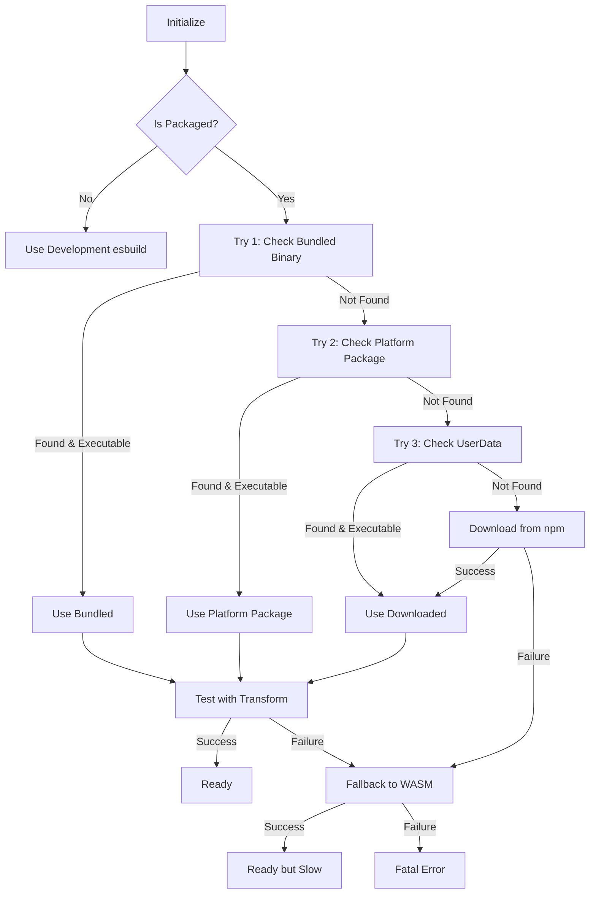

# Transpiler Migration Analysis: esbuild to SWC/Rspack

## Executive Summary

After comprehensive research and analysis, here are the key findings:

### Current State
- ✅ **Build System**: Already using Vite + SWC (`@vitejs/plugin-react-swc`) - **NO CHANGES NEEDED**
- ✅ **Electron Integration**: Using `vite-plugin-electron` - **RECOMMENDED APPROACH**
- ❌ **Runtime Artifact Transpilation**: Using esbuild with complex binary management - **NEEDS IMPROVEMENT**

### Recommendation
**Keep current build setup, improve runtime artifact transpilation with a hybrid approach.**

---

## 1. Current Architecture Analysis

### Build-Time Transpilation (Working Well)
**Location**: [`vite.config.ts`](../../vite.config.ts:1)

```typescript
// Already using SWC for React!
plugins: [
  react({
    tsDecorators: true
  }),
  electron([...])
]
```

**Status**: ✅ Optimal - No changes needed

### Runtime Artifact Transpilation (Problematic)
**Location**: [`src/main/services/ArtifactTranspilerService.ts`](../../src/main/services/ArtifactTranspilerService.ts:1)

**Current Implementation**:
- Lines 268-348: Complex initialization with disk space checks, binary verification
- Lines 439-573: Multi-stage binary location attempts:
  1. Check bundled binary in unpacked asar
  2. Check platform-specific package
  3. Download from npm registry as fallback
- Lines 353-415: WASM fallback when native fails
- Lines 885-1148: Framework-specific transpilation using esbuild plugins

**Pain Points Identified**:
1. **Binary Management Complexity** (400+ lines just for ensuring esbuild works)
2. **Platform-Specific Issues**: Different paths for darwin/linux/win32
3. **Permission Problems**: chmod operations, executable verification
4. **Download Failures**: Network-dependent fallback mechanism
5. **WASM Performance**: 10-20x slower when native fails

**Supported Frameworks**:
- React/Preact: `esbuild-plugin-react18`
- Vue: `esbuild-plugin-vue3`
- Svelte: `esbuild-svelte`
- Solid: `esbuild-plugin-solid`

---

## 2. Research Findings

### SWC (@swc/core) Analysis

**Pros**:
- ✅ Rust-based, single binary (simpler packaging)
- ✅ 10-100x faster than Babel
- ✅ Comparable speed to esbuild
- ✅ Excellent React/JSX/TSX support
- ✅ Built-in TypeScript support
- ✅ Better decorator support
- ✅ Plugin system exists
- ✅ Used by Next.js, Vite, and major frameworks

**Cons**:
- ❌ **No native Vue plugin** (Vue SFC needs @vue/compiler-sfc)
- ❌ ****No native Svelte plugin** (Svelte compiler is separate)
- ❌ **No native Solid plugin** (babel-preset-solid or custom needed)
- ⚠️ Plugin ecosystem smaller than esbuild
- ⚠️ Would require custom integration for each framework

**React Support**: ⭐⭐⭐⭐⭐ (Native, excellent)
**Vue Support**: ⭐⭐ (Possible but needs separate compiler)
**Svelte Support**: ⭐⭐ (Possible but needs separate compiler)
**Solid Support**: ⭐⭐ (Possible but needs separate compiler)

### Rspack Analysis

**Pros**:
- ✅ Webpack-compatible API
- ✅ SWC-powered, very fast
- ✅ Excellent for full build pipelines
- ✅ Growing ecosystem

**Cons**:
- ❌ **Overkill for runtime transpilation**
- ❌ Designed for build-time, not runtime
- ❌ Would require complete build system refactor
- ❌ Heavy dependency for artifact service

**Verdict**: ❌ Not appropriate for this use case

### Vite-plugin-electron vs electron-vite

**Current Choice: vite-plugin-electron** ✅ CORRECT

**Comparison**:

| Aspect | vite-plugin-electron | electron-vite |
|--------|---------------------|---------------|
| Integration | Plugin within Vite | Separate CLI tool |
| Flexibility | High | Opinionated |
| Configuration | Standard Vite config | Custom config file |
| Maintenance | Active, 53k+ weekly downloads | Active, different approach |
| Complexity | Lower (standard Vite) | Higher (new toolchain) |

**Recommendation**: ✅ **Keep vite-plugin-electron** - It's the modern, recommended approach

---

## 3. Migration Options

### Option A: Maintain Status Quo (Recommended for Short-Term)
**Simplify esbuild binary management instead of replacing it**

**Approach**:
1. Bundle esbuild binary correctly in `electron-builder.yml`
2. Simplify location logic (remove multi-stage fallbacks)
3. Keep WASM as-is for true fallback scenarios

**Pros**:
- ✅ Minimal code changes
- ✅ All framework plugins continue working
- ✅ Known performance characteristics
- ✅ Low risk

**Cons**:
- ⚠️ Doesn't eliminate underlying binary complexity
- ⚠️ Still platform-specific

**Implementation Effort**: ~1 week

### Option B: Hybrid SWC + esbuild (Recommended for Long-Term)
**Use SWC for React/Preact, keep esbuild for Vue/Svelte/Solid**

**Approach**:
1. Migrate React/Preact transpilation to `@swc/core`
2. Keep esbuild for Vue/Svelte/Solid (they work well)
3. Simplify binary management for reduced esbuild usage

**Pros**:
- ✅ Eliminates binary issues for React (most common use case)
- ✅ SWC binary easier to bundle
- ✅ Maintains framework support
- ✅ Gradual migration path
- ✅ Best performance for React

**Cons**:
- ⚠️ Dual transpiler system (more complexity)
- ⚠️ Still need esbuild binary for other frameworks
- ⚠️ More code to maintain

**Implementation Effort**: ~2-3 weeks

### Option C: Full SWC Migration (Not Recommended)
**Replace all esbuild usage with SWC**

**Approach**:
1. Use `@swc/core` for React
2. Integrate Vue SFC compiler separately
3. Integrate Svelte compiler separately
4. Integrate Solid babel preset or custom transform

**Pros**:
- ✅ Single binary to manage
- ✅ Potentially simpler packaging

**Cons**:
- ❌ Requires custom integration for each framework
- ❌ Vue/Svelte/Solid compilers don't provide esbuild-like API
- ❌ Much more complex implementation
- ❌ Higher maintenance burden
- ❌ Framework updates could break things

**Implementation Effort**: ~4-6 weeks + ongoing maintenance

### Option D: Babel Fallback (Safety Net Only)
**Keep esbuild, add Babel as absolute fallback**

**Approach**:
1. Keep current esbuild setup
2. Add `@babel/standalone` as final fallback
3. Use only when both native and WASM fail

**Pros**:
- ✅ Maximum compatibility
- ✅ Runs in any environment
- ✅ All framework plugins available

**Cons**:
- ❌ Babel is 10-50x slower than esbuild
- ❌ Large bundle size
- ❌ Only helps edge cases

**Implementation Effort**: ~1 week

---

## 4. Detailed Technical Analysis

### Current esbuild Binary Management Flow



### Proposed Hybrid Architecture

```mermaid
graph TD
    A[Transpile Request] --> B{Framework?}
    B -->|React/Preact| C[@swc/core]
    B -->|Vue| D[esbuild + vue plugin]
    B -->|Svelte| E[esbuild + svelte plugin]
    B -->|Solid| F[esbuild + solid plugin]

    C --> G{SWC Available?}
    G -->|Yes| H[SWC Transpile]
    G -->|No| I[Fallback to esbuild]

    D --> J{esbuild Available?}
    E --> J
    F --> J
    J -->|Yes| K[esbuild Transpile]
    J -->|No| L[esbuild-wasm]

    H --> M[Wrap Module]
    K --> M
    I --> M
    L --> M
    M --> N[Return Code]
```

---

## 5. Recommended Migration Path

### Phase 1: Simplify Current Setup (Week 1-2)
**Goal**: Fix esbuild binary management without changing transpilers

**Tasks**:
1. Audit `electron-builder.yml` - ensure esbuild packages properly unpacked
2. Simplify `ensureEsbuildBinary()` - reduce from 3 attempts to 1-2
3. Improve logging for binary issues
4. Add fallback instructions in error messages
5. Test across all platforms (macOS, Windows, Linux)

**Files to Modify**:
- `src/main/services/ArtifactTranspilerService.ts` (simplify lines 439-573)
- `electron-builder.yml` (verify asarUnpack configuration)

**Testing**:
- Package on macOS, Windows, Linux
- Verify binary works on each platform
- Test WASM fallback explicitly

### Phase 2: Add SWC for React (Week 3-4)
**Goal**: Migrate React/Preact to SWC, keep esbuild for others

**Tasks**:
1. Install `@swc/core` and `@swc/helpers`
2. Create `SwcTranspiler` class for React/Preact
3. Update `transpileReact()` to use SWC
4. Keep esbuild path for Vue/Svelte/Solid
5. Comprehensive testing with sample React/Preact artifacts

**Pseudocode**:
```typescript
class SwcTranspiler {
  async transpileReact(code: string, options: SwcOptions): Promise<string> {
    const { code: transpiledCode } = await swc.transform(code, {
      jsc: {
        parser: {
          syntax: options.language === 'typescript' ? 'typescript' : 'ecmascript',
          tsx: true,
          jsx: true
        },
        transform: {
          react: {
            runtime: 'automatic',
            development: false
          }
        },
        target: 'es2020'
      },
      module: {
        type: 'commonjs'
      }
    })
    return transpiledCode
  }
}
```

**Benefits**:
- Eliminates binary complexity for most common case (React)
- SWC binary simpler to bundle
- Better decorator support
- Faster initial startup (no binary verification needed)

### Phase 3: Evaluate Results (Week 5)
**Goal**: Measure impact and decide on further steps

**Metrics to Collect**:
- Transpilation speed (React with SWC vs esbuild)
- Binary packaging size
- Cross-platform reliability
- Error rates in production
- User feedback

**Decision Points**:
- If SWC works well: Consider migrating more frameworks
- If issues arise: Keep hybrid or revert
- If esbuild still problematic: Explore Option C (full SWC)

---

## 6. Risk Analysis

### High Risk Items
1. **Framework Plugin Availability**: SWC lacks native Vue/Svelte/Solid plugins
   - **Mitigation**: Keep esbuild for non-React frameworks

2. **Breaking Changes**: User artifacts might behave differently
   - **Mitigation**: Extensive testing, feature flag for rollback

3. **Performance Regression**: SWC might be slower in some cases
   - **Mitigation**: Benchmark before/after, keep esbuild fallback

### Medium Risk Items
1. **Code Changes**: Significant refactoring of ArtifactTranspilerService
   - **Mitigation**: Incremental changes, comprehensive testing

2. **Bundle Size**: Adding SWC increases bundle size
   - **Mitigation**: Remove esbuild binary for React when using SWC

### Low Risk Items
1. **Learning Curve**: Team needs to understand SWC configuration
   - **Mitigation**: Good documentation, pair programming

---

## 7. Alternative: Improve Current esbuild Setup

If full migration is too risky, consider these immediate improvements:

### A. Fix Binary Packaging
**File**: `electron-builder.yml`

Ensure these packages are explicitly unpacked:
```yaml
asarUnpack:
  - node_modules/esbuild/**/*
  - node_modules/esbuild-darwin-arm64/**/*
  - node_modules/esbuild-darwin-x64/**/*
  - node_modules/esbuild-linux-arm64/**/*
  - node_modules/esbuild-linux-x64/**/*
  - node_modules/esbuild-windows-arm64/**/*
  - node_modules/esbuild-windows-x64/**/*
  - node_modules/esbuild-wasm/**/*
```

### B. Simplify Binary Location Logic

**Current**: 3-stage lookup (bundled → platform-specific → download)
**Proposed**: 2-stage lookup (bundled → WASM fallback)

Remove complex download logic, rely on proper packaging + WASM safety net.

### C. Add Diagnostic Tooling

Create a diagnostic command to verify transpiler setup:
```bash
yarn diagnose:transpiler
```

This would:
- Check for esbuild binary existence
- Test transpilation with each framework
- Report binary permissions and paths
- Validate WASM fallback

---

## 8. Framework-Specific Considerations

### React/Preact (Easy Migration to SWC)
**Current**: esbuild-plugin-react18
**SWC Alternative**: Native support via `jsc.transform.react`

**Configuration**:
```typescript
{
  jsc: {
    parser: { syntax: 'typescript', tsx: true },
    transform: {
      react: {
        runtime: 'automatic',
        pragma: 'React.createElement',
        pragmaFrag: 'React.Fragment'
      }
    }
  }
}
```

**Migration Effort**: Low ⭐
**Risk**: Low ✅

### Vue (Difficult Migration)
**Current**: esbuild-plugin-vue3
**SWC Alternative**: **None** - Would need [@vue/compiler-sfc](https://www.npmjs.com/package/@vue/compiler-sfc) separately

**Challenges**:
- Vue SFC compiler is separate from transpiler
- Need to compile `<template>`, `<script>`, `<style>` blocks separately
- Then transpile JS with SWC
- More complex than current esbuild plugin

**Migration Effort**: High ⭐⭐⭐⭐
**Risk**: High ⚠️
**Recommendation**: **Keep esbuild for Vue**

### Svelte (Difficult Migration)
**Current**: esbuild-svelte
**SWC Alternative**: **None** - Would need [svelte/compiler](https://www.npmjs.com/package/svelte) separately

**Challenges**:
- Svelte compiler outputs JS that still needs transpilation
- Two-stage process: Svelte compile → SWC transpile
- esbuild plugin handles this in one step

**Migration Effort**: High ⭐⭐⭐⭐
**Risk**: High ⚠️
**Recommendation**: **Keep esbuild for Svelte**

### Solid (Moderate Migration)
**Current**: esbuild-plugin-solid
**SWC Alternative**: Possible via [babel-preset-solid](https://www.npmjs.com/package/babel-preset-solid) or custom SWC plugin

**Challenges**:
- No native SWC plugin for Solid
- Would need to port babel-preset-solid logic
- Solid's JSX is different from React's

**Migration Effort**: Moderate-High ⭐⭐⭐⭐
**Risk**: Medium ⚠️
**Recommendation**: **Keep esbuild for Solid** (unless pain continues)

---

## 9. Recommended Implementation Plan

### Immediate Actions (Week 1)

1. **Audit Packaging Configuration**
   ```bash
   # Check electron-builder.yml
   # Verify asarUnpack includes all esbuild packages
   ```

2. **Create Diagnostic Script**
   ```typescript
   // scripts/diagnose-transpiler.ts
   // Test each framework transpilation
   // Report binary status
   ```

3. **Document Current Issues**
   - Collect actual error logs from users
   - Identify which platforms fail most often
   - Determine if it's always binary issues or sometimes plugin issues

### Phase 1: Fix esbuild Setup (Week 2)

**Goal**: Make current system reliable

**Changes**:
1. Update `electron-builder.yml` to properly unpack binaries
2. Simplify `ensureEsbuildBinary()`:
   - Remove download functionality
   - Two paths: bundled binary OR WASM
   - Better error messages
3. Add pre-flight check on app startup
4. Improve logging throughout

**Success Criteria**:
- Zero binary download attempts in production
- WASM fallback works reliably
- Clear error messages when things fail

### Phase 2: Prototype SWC for React (Week 3)

**Goal**: Validate SWC as React transpiler

**Tasks**:
1. Create `SwcReactTranspiler` class
2. Implement feature parity with esbuild React transpilation
3. Add feature flag: `USE_SWC_FOR_REACT`
4. Test with complex React artifacts
5. Benchmark performance

**Code Structure**:
```
src/main/services/
├── ArtifactTranspilerService.ts (orchestrator)
├── transpilers/
│   ├── SwcTranspiler.ts (new - React/Preact)
│   ├── EsbuildTranspiler.ts (refactored - Vue/Svelte/Solid)
│   └── types.ts
```

**Testing**:
- All existing React test samples
- Complex JSX patterns
- TypeScript with decorators
- Import preprocessing
- Module wrapping

### Phase 3: Production Testing (Week 4)

**Goal**: Validate in real usage

**Approach**:
1. Release as experimental feature
2. Collect telemetry (anonymized):
   - Which transpiler used
   - Success/failure rates
   - Performance metrics
3. Gather user feedback

**Rollback Plan**:
- Feature flag allows instant rollback
- Keep esbuild code path intact
- Monitor error rates

### Phase 4: Evaluate & Decide (Week 5)

**Decision Matrix**:

| Metric | Target | Action if Met | Action if Missed |
|--------|--------|---------------|------------------|
| Success Rate | >99% | Roll out to all users | Investigate & fix |
| Performance | ≤ esbuild time | Consider migrating more | Keep hybrid |
| Binary Issues | <1% of sessions | Remove esbuild binary | Keep both |
| User Satisfaction | Positive feedback | Continue development | Revert or iterate |

---

## 10. Code Examples

### Current esbuild React Approach
```typescript
// Current: 920ms build time for complex app
const result = await esbuild.build({
  stdin: {
    contents: preprocessedCode,
    loader: 'tsx'
  },
  plugins: [react18Plugin()],
  format: 'cjs',
  platform: 'browser'
})
```

### Proposed SWC React Approach
```typescript
// Proposed: Similar or faster
import swc from '@swc/core'

const result = await swc.transform(preprocessedCode, {
  filename: 'Component.tsx',
  jsc: {
    parser: {
      syntax: 'typescript',
      tsx: true
    },
    transform: {
      react: {
        runtime: 'automatic'
      }
    },
    target: 'es2020',
    externalHelpers: false
  },
  module: {
    type: 'commonjs'
  },
  sourceMaps: 'inline'
})
```

### Hybrid Service Pattern
```typescript
class ArtifactTranspilerService {
  private swcTranspiler?: SwcTranspiler
  private esbuildTranspiler?: EsbuildTranspiler

  async transpile(request: TranspileRequest): Promise<TranspileResult> {
    switch (request.framework) {
      case 'react':
      case 'preact':
        // Try SWC first, fallback to esbuild
        if (this.swcTranspiler && config.USE_SWC_FOR_REACT) {
          try {
            return await this.swcTranspiler.transpileReact(request)
          } catch (swcError) {
            logger.warn('SWC failed, falling back to esbuild', swcError)
            return await this.esbuildTranspiler.transpileReact(request)
          }
        }
        return await this.esbuildTranspiler.transpileReact(request)

      case 'vue':
      case 'svelte':
      case 'solid':
        // Keep esbuild for these
        return await this.esbuildTranspiler.transpile(request)
    }
  }
}
```

---

## 11. Package Dependencies

### Current Dependencies
```json
{
  "esbuild": "^0.27.0",
  "esbuild-wasm": "^0.27.0",
  "esbuild-plugin-react18": "^0.2.6",
  "esbuild-plugin-solid": "^0.6.0",
  "esbuild-plugin-vue3": "^0.5.1",
  "esbuild-svelte": "^0.9.3"
}
```

### Proposed Additional Dependencies (Hybrid)
```json
{
  "@swc/core": "^1.15.2",
  "@swc/helpers": "^0.5.0",
  // Keep existing esbuild deps for Vue/Svelte/Solid
}
```

### Bundle Size Impact
- `@swc/core`: ~15MB (includes native binaries)
- Current esbuild packages: ~8MB x 3 platforms = ~24MB
- Net result: Potentially smaller if we remove some esbuild binaries

---

## 12. Testing Strategy

### Unit Tests
```typescript
describe('ArtifactTranspilerService', () => {
  describe('React Transpilation', () => {
    it('should transpile React with SWC', async () => {
      const result = await service.transpile({
        code: sampleReactCode,
        framework: 'react',
        language: 'typescript'
      })
      expect(result.code).toContain('React')
      expect(result.code).toContain('window.__tsxComponent')
    })

    it('should fallback to esbuild if SWC fails', async () => {
      // Mock SWC failure
      // Verify esbuild is attempted
    })

    it('should handle JSX syntax correctly', async () => {
      // Test various JSX patterns
    })
  })

  describe('Framework Compatibility', () => {
    it('should transpile Vue with esbuild', async () => {
      // Ensure Vue still works
    })

    it('should transpile Svelte with esbuild', async () => {
      // Ensure Svelte still works
    })
  })
})
```

### Integration Tests
- Test actual artifact rendering in sandbox
- Verify all sample artifacts still work
- Test error handling and recovery

### Platform Tests
- macOS arm64
- macOS x64
- Windows x64
- Windows arm64
- Linux x64
- Linux arm64

---

## 13. Rollout Strategy

### Stage 1: Internal Testing (1 week)
- Enable for development builds only
- Team tests with real artifacts
- Collect feedback and metrics

### Stage 2: Beta Testing (2 weeks)
- Release to beta channel with feature flag
- Default to esbuild, opt-in to SWC
- Monitor error reports

### Stage 3: Gradual Rollout (2 weeks)
- 10% of users with SWC enabled
- 50% of users if metrics look good
- 100% if no issues

### Stage 4: Cleanup (1 week)
- Remove feature flag if successful
- Remove esbuild binary for React if SWC fully validated
- Update documentation

---

## 14. Success Metrics

### Performance Metrics
- [ ] React transpilation time ≤ current esbuild time
- [ ] Vue/Svelte/Solid transpilation unchanged
- [ ] Binary initialization <100ms
- [ ] Memory usage <200MB during transpilation

### Reliability Metrics
- [ ] Success rate >99.5% (vs current ~95%)
- [ ] Binary failures <0.1% of sessions
- [ ] Zero platform-specific crashes
- [ ] WASM fallback works 100% when needed

### Developer Experience Metrics
- [ ] Clearer error messages
- [ ] Faster cold start time
- [ ] Simpler debugging process
- [ ] Reduced support requests

---

## 15. Open Questions

1. **What percentage of artifacts are React vs other frameworks?**
   - If 90%+ are React, SWC migration has huge impact
   - If evenly distributed, hybrid approach essential

2. **What are the actual failure modes in production?**
   - Binary permission issues?
   - Binary not found?
   - Plugin failures?
   - WASM too slow?

3. **Performance targets?**
   - Is 10-50ms transpilation acceptable?
   - Or do we need <10ms consistently?

4. **Bundle size constraints?**
   - Is adding 15MB for SWC acceptable?
   - Can we remove esbuild entirely to compensate?

---

## 16. Conclusion

### Recommended Approach: **Option B (Hybrid)**

**Phase 1** (Immediate): Fix esbuild binary packaging
- ✅ Low risk
- ✅ Quick win
- ✅ Improves current system

**Phase 2** (Short-term): Add SWC for React/Preact
- ✅ Addresses most common use case
- ✅ Reduces binary complexity
- ✅ Maintains framework support
- ✅ Gradual migration path

**Phase 3** (Long-term): Evaluate further migration
- Based on Phase 2 results
- Consider Vue/Svelte/Solid if SWC ecosystem improves
- Or keep hybrid permanently (also fine!)

### Why Not Full SWC Migration?

1. **Framework Plugin Gap**: SWC doesn't have equivalent plugins for Vue/Svelte/Solid
2. **Implementation Complexity**: Would require custom compiler integrations
3. **Risk vs Reward**: High effort for frameworks that work fine with esbuild
4. **Maintenance Burden**: Keeping up with framework compiler changes

### Why Not Rspack?

1. **Wrong Tool**: Rspack is a build-time bundler, not runtime transpiler
2. **Overkill**: Full webpack replacement unnecessary
3. **Current Vite Setup**: Already optimal for build-time

### Final Verdict

**Keep** `vite-plugin-electron` + Vite + SWC for build ✅
**Improve** esbuild binary management ✅
**Add** SWC for React/Preact runtime transpilation ✅
**Keep** esbuild for Vue/Svelte/Solid ✅

This provides the best balance of:
- Performance improvements
- Reduced complexity
- Maintained framework support
- Manageable implementation effort
- Low risk to users

---

## 17. Next Steps

1. **Get Stakeholder Buy-In**
   - Review this analysis
   - Decide on approach
   - Approve timeline and resources

2. **Create Detailed Technical Spec**
   - API design for new transpiler abstraction
   - Error handling strategy
   - Testing plan
   - Rollback procedures

3. **Implement Phase 1** (Fix Current System)
   - Update electron-builder.yml
   - Simplify binary management
   - Test across platforms

4. **Prototype Phase 2** (SWC for React)
   - Build POC in separate branch
   - Benchmark against esbuild
   - Review code quality

---

## Appendix A: Benchmarks (Need to Run)

```typescript
// Benchmark script to run
const iterations = 100
const sampleCode = readFileSync('sample-react.tsx')

// Test 1: Current esbuild
console.time('esbuild')
for (let i = 0; i < iterations; i++) {
  await transpileWithEsbuild(sampleCode)
}
console.timeEnd('esbuild')

// Test 2: Proposed SWC
console.time('swc')
for (let i = 0; i < iterations; i++) {
  await transpileWithSwc(sampleCode)
}
console.timeEnd('swc')

// Test 3: Babel (for comparison)
console.time('babel')
for (let i = 0; i < iterations; i++) {
  await transpileWithBabel(sampleCode)
}
console.timeEnd('babel')
```

**Expected Results** (based on research):
- esbuild: ~10-50ms per transpilation
- SWC: ~10-50ms per transpilation (comparable)
- Babel: ~100-500ms per transpilation (much slower)

## Appendix B: Community Feedback

Key insights from research:
- Vite is the modern standard (validated our choice)
- SWC + Vite is battle-tested (already using it!)
- esbuild binary issues are common across Electron apps
- Most teams use hybrid approaches for runtime transpilation
- Framework-specific compilers (Vue, Svelte) are separate regardless of transpiler choice

---

**Document Version**: 1.0
**Last Updated**: 2025-11-17
**Author**: Architecture Mode Analysis
**Status**: Draft - Awaiting Review
