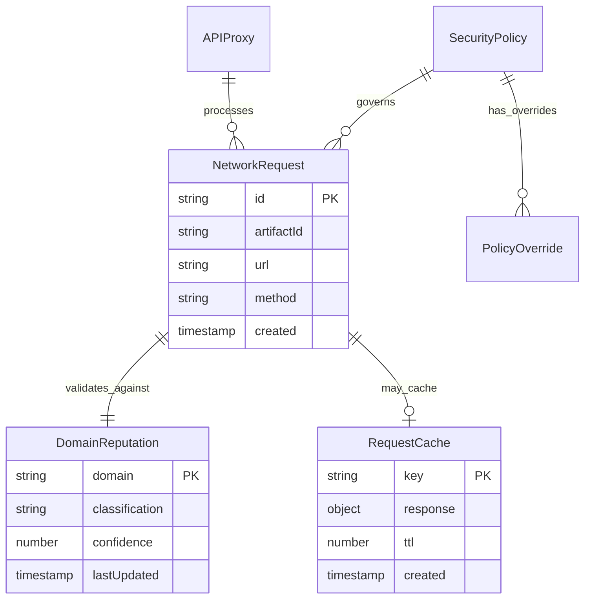

# Data Model: Secure Network-Enabled TSX Artifacts

**Feature**: 002-secure-network-artifacts
**Model Date**: 2025-01-11
**Status**: Phase 1 Design

## Core Entities

### NetworkRequest

Represents an HTTP request from a TSX artifact including all metadata for security validation and tracking.

**Properties**:
```typescript
interface NetworkRequest {
  id: string                    // Unique request identifier
  artifactId: string           // Source artifact identifier
  url: string                  // Target URL (validated)
  method: HttpMethod           // HTTP method (GET, POST, PUT, DELETE)
  headers: Record<string, string> // Request headers (sanitized)
  body?: string                // Request body (if applicable)
  timeout: number              // Request timeout in milliseconds
  timestamp: number            // Request creation timestamp
  securityMetadata: SecurityMetadata
}

type HttpMethod = 'GET' | 'POST' | 'PUT' | 'DELETE'
```

**Validation Rules**:
- `id`: UUID v4 format
- `url`: Must be valid HTTP/HTTPS URL, not private network
- `method`: Limited to supported HTTP methods
- `headers`: Sanitized, no sensitive headers allowed
- `timeout`: Between 1000ms and 30000ms
- `artifactId`: Must correspond to existing artifact

**State Transitions**:
1. `pending` → Request created, awaiting validation
2. `validating` → Security checks in progress
3. `approved` → Security checks passed, ready to execute
4. `executing` → Request in flight
5. `completed` → Request finished successfully
6. `failed` → Request failed or blocked
7. `cached` → Response served from cache

### DomainReputation

Security classification of domains with automatic updates from threat intelligence feeds.

**Properties**:
```typescript
interface DomainReputation {
  domain: string               // Domain name (normalized)
  classification: ReputationLevel
  sources: ReputationSource[]  // Contributing threat intel sources
  confidence: number           // Confidence score (0-1)
  lastUpdated: number          // Last check timestamp
  expiresAt: number           // Cache expiration timestamp
  metadata: ReputationMetadata
}

type ReputationLevel = 'trusted' | 'unknown' | 'suspicious' | 'blocked'

interface ReputationSource {
  provider: 'virustotal' | 'google_safe_browsing'
  score: number               // Provider-specific risk score
  details?: string           // Additional context
}

interface ReputationMetadata {
  categories?: string[]       // Threat categories
  malwareFamily?: string     // Known malware family
  firstSeen?: number         // First detection timestamp
}
```

**Validation Rules**:
- `domain`: Valid domain format, normalized to lowercase
- `classification`: Must be one of enum values
- `confidence`: Number between 0 and 1
- `lastUpdated`: Valid timestamp
- `expiresAt`: Future timestamp

**Update Logic**:
- Automatic refresh when expired
- Escalation on classification changes
- Fallback when providers unavailable

### APIProxy

Intermediary service configuration that handles, validates, and routes network requests from artifacts.

**Properties**:
```typescript
interface APIProxy {
  id: string                   // Proxy instance identifier
  status: ProxyStatus          // Current operational status
  settings: ProxySettings      // Configuration settings
  statistics: ProxyStatistics  // Performance metrics
}

type ProxyStatus = 'active' | 'maintenance' | 'error'

interface ProxySettings {
  maxConcurrentRequests: number    // Default: 10
  requestTimeoutMs: number         // Default: 10000
  enableCaching: boolean           // Default: true
  rateLimitPerMinute: number       // Default: 100
  enableReputationCheck: boolean   // Default: true
  allowPrivateNetworks: boolean    // Default: false
}

interface ProxyStatistics {
  totalRequests: number
  successfulRequests: number
  blockedRequests: number
  cacheHitRate: number
  averageResponseTime: number
  uptime: number
}
```

**Validation Rules**:
- `maxConcurrentRequests`: Between 1 and 50
- `requestTimeoutMs`: Between 1000 and 30000
- `rateLimitPerMinute`: Between 10 and 1000
- Statistics are read-only, updated by system

### SecurityPolicy

Rules defining allowed domains, request types, and security restrictions with user override capabilities.

**Properties**:
```typescript
interface SecurityPolicy {
  id: string                   // Policy identifier
  version: string              // Policy version
  rules: SecurityRule[]        // Ordered list of rules
  overrides: PolicyOverride[]  // User-specific overrides
  enforcementLevel: EnforcementLevel
  lastUpdated: number
}

interface SecurityRule {
  id: string
  type: RuleType
  pattern: string              // URL pattern or domain
  action: RuleAction
  reason: string              // Human-readable explanation
  priority: number            // Rule evaluation order
}

type RuleType = 'domain' | 'url_pattern' | 'ip_range' | 'port'
type RuleAction = 'allow' | 'block' | 'warn'
type EnforcementLevel = 'strict' | 'moderate' | 'permissive'

interface PolicyOverride {
  sessionId: string           // Session-specific override
  pattern: string            // What pattern to override
  action: RuleAction         // Override action
  expiresAt: number         // Session expiration
  approvedBy: 'user' | 'admin'
}
```

**Validation Rules**:
- Rules processed in priority order (lower number = higher priority)
- Overrides are temporary and session-scoped
- Patterns must be valid regex or domain formats

**Built-in Rules**:
1. Block private networks (192.168.x.x, 10.x.x.x, localhost)
2. Block non-HTTP/HTTPS protocols
3. Block known malicious domains
4. Allow common public APIs

### RequestCache

Temporary storage for API responses to improve performance and reduce external calls.

**Properties**:
```typescript
interface RequestCache {
  key: string                 // Cache key (URL + relevant headers)
  response: CachedResponse
  metadata: CacheMetadata
}

interface CachedResponse {
  status: number              // HTTP status code
  headers: Record<string, string>
  body: string               // Response body
  timestamp: number          // Cache creation time
}

interface CacheMetadata {
  ttl: number                // Time to live in seconds
  hitCount: number           // Number of cache hits
  size: number               // Response size in bytes
  contentType: string        // Response content type
  source: 'http_headers' | 'smart_default' | 'user_override'
}
```

**Cache Key Generation**:
```typescript
function generateCacheKey(request: NetworkRequest): string {
  const relevantHeaders = {
    'authorization': request.headers.authorization,
    'accept': request.headers.accept,
    'user-agent': request.headers['user-agent']
  }
  return `${request.method}:${request.url}:${JSON.stringify(relevantHeaders)}`
}
```

**TTL Logic**:
- Respect HTTP `Cache-Control` headers when present
- Default 15 minutes for dynamic content (API responses)
- Default 1 hour for static content (images, files)
- Maximum TTL: 24 hours
- Minimum TTL: 30 seconds

## Relationships



## Storage Implementation

### Primary Storage

**SQLite Database**: Used for persistent data requiring queries and relationships
- DomainReputation records
- SecurityPolicy configurations
- APIProxy statistics
- Long-term request logs (for security monitoring)

### Memory Storage

**In-Memory Maps**: Used for active session data requiring fast access
- Active NetworkRequest tracking
- RequestCache (with LRU eviction)
- Session-specific PolicyOverrides
- Rate limiting counters (token buckets)

### File System

**JSON Files**: Used for configuration and backup
- Default SecurityPolicy templates
- APIProxy configuration backups
- Request/response samples for testing

## Data Flow

1. **Request Creation**: TSX artifact creates NetworkRequest through IPC
2. **Security Validation**: Check against SecurityPolicy and DomainReputation
3. **Cache Check**: Look for cached response in RequestCache
4. **Proxy Execution**: APIProxy handles request if not cached
5. **Response Caching**: Store response in RequestCache with appropriate TTL
6. **Statistics Update**: Update APIProxy statistics and logging

## Performance Considerations

### Memory Management

- RequestCache with LRU eviction (max 1000 entries)
- DomainReputation cache cleanup (daily)
- Session cleanup on application restart

### Database Optimization

- Indexes on domain, timestamp, artifactId
- Periodic cleanup of old logs (30-day retention)
- Connection pooling for concurrent access

### Caching Strategy

- Multi-tier: Memory → SQLite → Network
- Parallel cache warming for popular domains
- Intelligent prefetching based on artifact patterns

---

**Data Model Complete**: All entities defined with validation rules and relationships established.